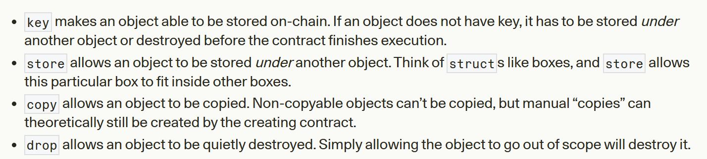

# Move Security Audit Checklist

## Common Vulnerabilities

1. **Arithmetic Overflow/Underflow**
   - Move is vulnerable to overflow/underflow attacks while performing arithmetic operations.
   - Unlike Solidity, Move doesn't have built-in overflow/underflow checks.
   - Always use `Math` modules provided by Sui/Aptos or implement bounds checking.

   ```move
   #[test]
   fun test_overflow(): u8 {
      let num: u8 = 255;
      num = num + 1;
      return num
   }
   // VMError: ARITHMETIC_ERROR
   
   // However, bitwise operations don't check for overflow:
   #[test]
   fun test_overflow(): u8 {
      let num: u8 = 255;
      num = num << 2;
      return num
   }
   // This will overflow without an error!
   ```

2. **Division Precision Issues**
   - Integer division truncates results and can lead to precision loss.
   - Division by zero must be explicitly prevented.
   - Consider using fixed-point arithmetic for precision-critical operations.

   ```move
   #[test]
   public fun division_precision() {
       let floored_div = 35 / 6;
       debug::print<u8>(&floored_div);
   }
   // Output: 5
   ```

3. **Reentrancy Protection**
   - While Move doesn't have direct reentrancy like Solidity, cross-module calls can still introduce call-flow vulnerabilities.
   - Sui's object model allows for different reentrancy patterns than traditional blockchains.
   - Follow Check-Effects-Interactions pattern when designing functions.

   ```move
   // In Solidity, this would be vulnerable:
   function arbritrary_call(address addr, bytes calldata data) {
       addr.call{value: 1000}(data);
   }
   
   // In Move, dynamic dispatch is not directly possible
   // Functions must be statically declared and imported
   ```

4. **DOS due to Unbounded Loops**
   - Loops without proper bounds can exhaust gas and cause denial of service.
   - Always implement limits on loop iterations.
   - Consider pagination patterns for large data processing.

   ```move
   #[test] // THIS CODE TIMES OUT!
   public fun long_loop() {
       let i = 1;
       let n = 1000000; 
       while (i <= n) {
           i = i + 1;
       };
   }
   ```

5. **Access Control using Capabilities**
   - Move uses capability-based security model.
   - Verify that capabilities are properly guarded and not accidentally exposed.
   - Check for capability leakage through public functions.

   ```move
   public fun assert_vm(account: &signer) {
       assert!(signer::address_of(account) == @vm_reserved, error::permission_denied(EVM))
   }
   
   // More robust capability pattern
   module PropertyTesting::cap_tester {
       use std::signer::{address_of};
       struct Type1 has key {} 
       struct Type2 has key {} 
       struct Capability<phantom TYPE> has key{}
       
       public fun cap_1_need(_cap: &Capability<Type1>) {}
       
       public fun cap_2_need(_cap: &Capability<Type2>) {}
       
       public fun get_cap_type1(person_1: &signer) {
           let cap_type_1 = Capability<Type1> {};
           move_to<Capability<Type1>>(person_1, cap_type_1);
       }
   }
   ```

6. **Function Visibility**
   - Ensure proper visibility modifiers (`public`, `entry`, `friend`) are used.
   - Restrict sensitive functions appropriately.
   - Check friend modules for potential privilege escalation.

7. **Oracle Price Manipulation**
   - Price oracles are susceptible to manipulation if not properly implemented.
   - Implement Time-Weighted Average Price (TWAP) or multiple oracle sources.
   - Use circuit breakers to halt system during unusual price movements.

   ```move
   // Vulnerable oracle implementation that relies on a single source
   public fun get_price<CoinType>(): u64 {
       *&borrow_global<OracleFeed>(@oracles).price
   }
   
   // Better approach: Use TWAP with freshness check
   public fun get_twap_price<CoinType>(): u64 acquires OracleTWAP {
       let twap = borrow_global<OracleTWAP<CoinType>>(@oracles);
       assert!(timestamp::now_seconds() - twap.last_update < MAX_ORACLE_DELAY, ERROR_STALE_PRICE);
       twap.cumulative_price / twap.observation_count
   }
   ```

8. **Flash Loan Vulnerabilities**
   - Flash loans without proper authentication can be exploited.
   - Ensure the "hot potato" pattern is correctly enforced for flash loan tokens.
   - Implement hooks to verify loan repayment and prevent unauthorized uses.

   ```move
   // Hot potato pattern for flash loans
   struct FlashLoanToken<phantom CoinType> {
       amount: u64,
   }
   
   // Flash loans must be repaid in the same transaction
   public fun borrow<CoinType>(
       amount: u64,
       callback: &mut CapabilityType,
   ): (Coin<CoinType>, FlashLoanToken<CoinType>) acquires Pool {
       // Logic to borrow coins
       (coins, FlashLoanToken<CoinType> { amount })
   }
   
   public fun repay<CoinType>(
       repayment: Coin<CoinType>,
       token: FlashLoanToken<CoinType>,
   ) acquires Pool {
       // Verify repayment amount matches borrowed amount
       assert!(coin::value(&repayment) >= token.amount, ERROR_INSUFFICIENT_REPAYMENT);
       let FlashLoanToken { amount: _ } = token; // Consume the token
       // Complete repayment
   }
   ```

9. **Zero-Value Assets**
   - Fungible assets with zero value can be created freely.
   - Ensure functions handle zero-value assets appropriately.
   - Validate asset amounts before performing critical operations.

   ```move
   // Vulnerable code that doesn't check for zero value
   public fun withdraw_hook<T: key>(
       store: Object<T>,
       amount: u64,
       transfer_ref: &TransferRef,
   ): FungibleAsset {
       // Should check: assert!(amount > 0, ERROR_ZERO_AMOUNT);
       fungible_asset::withdraw_with_ref(transfer_ref, store, amount)
   }
   
   // Remember: Anyone can create zero-value fungible assets!
   public fun zero<T: key>(metadata: Object<T>): FungibleAsset {
       FungibleAsset {
           metadata: object::convert(metadata),
           amount: 0,
       }
   }
   ```

10. **Object Ownership Transfer Issues**
    - In object-based models (Sui), ownership transfer can bypass other restrictions.
    - Verify ownership is managed consistently across all contract functions.
    - Implement additional validations beyond the basic ownership checks.

    ```move
    // Example vulnerability with parent object transfers bypassing child restrictions
    public fun untransferable_transfer(caller: &signer, recipient: address) {
        let constructor_ref = object::create_object(signer::address_of(caller));
        let object_addr = object::address_from_constructor_ref(&constructor_ref);
        let store = primary_fungible_store::ensure_primary_store_exists(object_addr, get_metadata());
        
        // Even if the fungible store is untransferable, the parent object can be moved
        object::transfer_raw(caller, object_addr, recipient);
        // Recipient can still interact with the "untransferable" store
    }
    ```

## Sui-Specific Considerations

11. **Object Model Security**
    - Verify correct usage of shared objects vs owned objects.
    - Check for proper object capabilities management.
    - Ensure transaction ordering dependencies are accounted for.

    ```move
    // Example of UID swapping attack:
    struct Cat has key {
        id: UID,
    }
    
    struct Dog has key {
        id: UID,
    }
    
    public entry fun transmute(cat: Cat, dog: Dog, ctx: &mut TxContext) {
        let Cat {
            id: cat_id,
        } = cat;
        let Dog {
            id: dog_id,
        } = dog;
        let new_cat = Cat {
            id: dog_id,
        };
        let new_dog = Dog {
            id: cat_id,
        };
        transfer::transfer(new_cat, tx_context::sender(ctx));
        transfer::transfer(new_dog, tx_context::sender(ctx));
    }
    ```

12. **Dynamic Fields**
    - Validate correct usage of dynamic fields.
    - Check for key collision vulnerabilities.
    - Verify proper cleanup of dynamic fields to prevent state bloat.

13. **Witness Pattern Implementation**
    - Ensure one-time witnesses are correctly implemented.
    - Verify type safety in witness patterns.
    - Check for unauthorized creation of protected resources.

14. **Object Hiding and Revealing**
    - Objects can be temporarily hidden by destructing and recovering UIDs.
    - Verify hidden/wrapped objects don't allow bypassing intended restrictions.
    - Monitor for unexpected object creation from stored UIDs.

    ```move
    // Example of hiding and recovering an object
    struct Cat has key {
        id: UID,
    }
    
    struct Tomb has key {
        id: UID,
        cat_id: UID,
    }
    
    public entry fun entomb(cat: Cat, ctx: &mut TxContext) {
        let Cat { id: cat_id } = cat; // Destruct cat to get UID
        let tomb = Tomb {
            id: object::new(ctx),
            cat_id: cat_id,
        };
        transfer::transfer(tomb, tx_context::sender(ctx));
    }
    
    public entry fun resurrect(tomb: Tomb, ctx: &mut TxContext) {
        let Tomb { id: tomb_id, cat_id: cat_id } = tomb;
        object::delete(tomb_id);
        let cat = Cat { id: cat_id }; // Recreate cat with same UID
        transfer::transfer(cat, tx_context::sender(ctx));
    }
    ```

## Aptos-Specific Considerations

15. **Table Data Structures**
    - Verify proper management of table entries.
    - Check for potential table exhaustion attacks.
    - Ensure proper error handling for table operations.

16. **Account Resources**
    - Verify proper initialization of account resources.
    - Check for resource duplication vulnerabilities.
    - Ensure proper resource cleanup.

    ```move
    // From OtterSec blog - lack of type checking in cancel_order function
    public fun cancel_order<BaseCoinType>(
            user: &signer,
            order_id: u64
        ) acquires OrderStore, CoinStore {
            // [...]
            deposit_funds<BaseCoinType>(order_store, address_of(user), order.base);
            // [...]
    }
    
    // The fix: Add the following type-checking assertion
    assert!(order.base_type == type_info::type_of<BaseCoinType>(), ERR_ORDER_WRONG_COIN_TYPE);
    ```

17. **Lack of Account Registration Check for Coin**
    - The `aptos_framework::coin` module requires that a CoinStore exists on the target account.
    - Always register accounts before deposit or withdraw operations.
    
    ```move
    // Add the following two lines to functions that might deposit coins
    coin::register<BaseCoinType>(user);
    coin::register<QuoteCoinType>(user);
    
    // The register function handles already-registered accounts
    public fun register<CoinType>(account: &signer) {
        let account_addr = signer::address_of(account);
        if (is_account_registered<CoinType>(account_addr)) {
            return
        };
        // [...]
    }
    ```

18. **Coin and Fungible Asset Coexistence Issues**
    - Aptos supports both the legacy Coin standard and the newer Fungible Asset standard.
    - Ensure consistent handling when managing both standards.
    - Verify coin-to-FA conversions maintain all security properties.

    ```move
    // From OtterSec blog - Coin to FA conversion issue
    // When creating the linked fungible asset, the max supply was incorrectly set to current supply
    primary_fungible_store::create_primary_store_enabled_fungible_asset(
        &metadata_object_cref,
        option::map(coin_supply<CoinType>(), |_| MAX_U128), // Should use MAX_U128 directly
        name<CoinType>(),
        symbol<CoinType>(),
        decimals<CoinType>(),
        string::utf8(b""),
        string::utf8(b""),
    );
    ```

## General Move Auditing

19. **Type Safety**
    - Verify proper generic type constraints.
    - Check for type confusion vulnerabilities.
    - Ensure phantom type parameters are used correctly.

20. **Resource Handling**
    - Ensure resources cannot be copied or dropped incorrectly.
    - Verify correct ownership transfer of resources.
    - Check for resource leaks in error paths.

    ```move
    // Example from OtterSec blog - Resource management issue
    struct OrderStore has key {
        current_id: u64,
        orders: vector<Order>,
        locked: Table<TypeInfo, u64>,
        liquidity: Table<TypeInfo, u64>,
        decimals: Table<TypeInfo, u8>
    }
    
    // Better practice: store resources within the users' accounts
    ```

21. **Gas Optimizations**
    - Review for inefficient computations.
    - Check storage access patterns.
    - Look for redundant operations.

    ```move
    // Aptos precision issue example
    ##[query]
    public fun calculate_protocol_fees(
        size: u64
    ): (u64) {
        return size * PROTOCOL_FEE_BPS / 10000
    }
    
    // If size < 10000/PROTOCOL_FEE_BPS, fee will round down to 0
    ```

22. **Fungible Asset Validation in Aptos**
    - When working with Fungible Assets in Aptos, always validate the metadata.
    - Unlike Coin types which are validated at compile-time, Fungible Asset types are defined at runtime.
    
    ```move
    // Example of vulnerable deposit function without metadata verification
    public fun deposit<T: key>(
        sender: &signer, fa: FungibleAsset
    ) acquires [...] {
        assert_not_paused();
        
        let fa_amount = fungible_asset::amount(&fa);
        let sender_address = address_of(sender);
        check_compliance(fa_amount, sender_address);
        
        increase_deposit(get_vault(sender_address), fa_amount);
        
        primary_fungible_store::deposit(global_vault_address(), fa);
        
        event::emit(Deposit {sender_address, fa_amount})
    }
    // The function doesn't validate the asset's metadata, creating a security risk
    ```

23. **Improper Error Handling**
    - Ensure errors are properly handled and don't leave contracts in inconsistent states.
    - Use appropriate error codes to distinguish between different failure cases.
    - Validate any fallback or error recovery logic.

    ```move
    // Poor error handling
    public fun transfer<CoinType>(from: &signer, to: address, amount: u64) {
        let balance = coin::balance<CoinType>(signer::address_of(from));
        if (balance >= amount) { // Do this check but don't handle failure case
            let coin = coin::withdraw<CoinType>(from, amount);
            coin::deposit<CoinType>(to, coin);
        }
        // Function silently fails if balance < amount
    }
    
    // Better approach
    public fun transfer<CoinType>(from: &signer, to: address, amount: u64) {
        let balance = coin::balance<CoinType>(signer::address_of(from));
        assert!(balance >= amount, error::invalid_argument(INSUFFICIENT_BALANCE));
        let coin = coin::withdraw<CoinType>(from, amount);
        coin::deposit<CoinType>(to, coin);
    }
    ```

24. **Time-based Vulnerabilities**
    - Be careful with timestamp-based logic, which can potentially be manipulated.
    - Implement safeguards against timestamp manipulation in critical time-sensitive operations.
    - Consider using block height or other metrics in addition to timestamps.

    ```move
    // Potentially vulnerable time-based function
    public fun is_expired(expiry: u64): bool {
        timestamp::now_seconds() > expiry
    }
    
    // More robust approach - adding tolerance to prevent minor timestamp fluctuations
    public fun is_within_valid_period(start: u64, end: u64): bool {
        let now = timestamp::now_seconds();
        now >= start && now <= end
    }
    ```

25. **Event Emission Issues**
    - Missing events for critical state changes can break off-chain indexing.
    - Incomplete event data can lead to gaps in external monitoring.
    - Verify events are properly emitted for all important operations.

    ```move
    // Proper deposit event emission
    public fun deposit<CoinType>(account: address, amount: u64) acquires CoinStore {
        let coin_store = borrow_global_mut<CoinStore<CoinType>>(account);
        coin_store.balance = coin_store.balance + amount;
        
        // Important: Emit an event for off-chain monitoring
        event::emit_event(
            &mut coin_store.deposit_events,
            DepositEvent { amount }
        );
    }
    ```

26. **Smart Contract Upgrades**
    - Verify upgrade mechanisms are properly secured.
    - Check for potentially dangerous state migrations.
    - Ensure backwards compatibility is maintained.

## Resources
- [Zellic: Move Fast and Break Things (Part 1)](https://www.zellic.io/blog/move-fast-and-break-things-pt-1)
- [Move Book](https://move-language.github.io/move/)
- [Sui Developer Documentation](https://docs.sui.io/)
- [Aptos Framework Documentation](https://aptos.dev/)
- [OtterSec Move Auditing Guidelines](https://osec.io/blog/tutorials/2022-09-06-common-move-bugs/)
- [Aptos vs. Sui Blockchain Guide](https://blaize.tech/blog/aptos-vs-sui-blockchain-a-detailed-guide/)
- [OtterSec Hitchhiker's Guide to Aptos Fungible Assets](https://osec.io/blog/2025-02-10-hitchhikers-guide-to-aptos-fungible-assets/)

